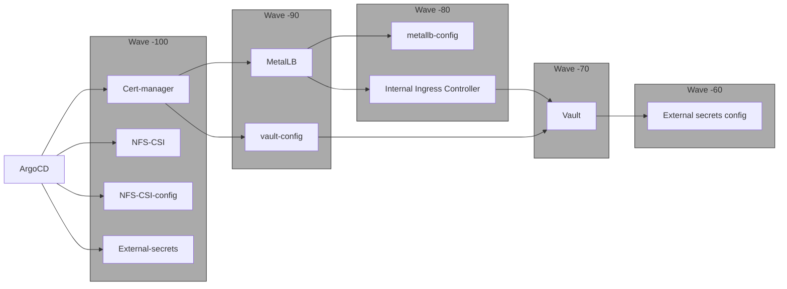

# Instructions

After running `terraform apply`, run the following to export the kubectl and talosctl configuration

```
terraform output -raw kubeconfig > /home/$(whoami)/.kube/config
terraform output -raw talosconfig > /home/$(whoami)/.talos/config
```

# Cheat sheet

Reset nodes to maintenance mode

```
talosctl reset \
    --system-labels-to-wipe STATE \
    --system-labels-to-wipe EPHEMERAL \
    --reboot=true \
    --graceful=false \
    -n $(kubectl get nodes -o jsonpath='{.items[*].status.addresses[?(@.type=="InternalIP")].address}' | tr ' ' ',')
```

Delete all resources from Terraform's state

```
terraform state rm $(terraform state list)
```

Get data-created configs

```
terraform output -json porteño_config | jq -r '.[0]' | yq -y > porteño.yaml
```

Get secrets

```
terraform output -raw talos_secrets_yaml | yq -y > tfsecrets.yaml
```


