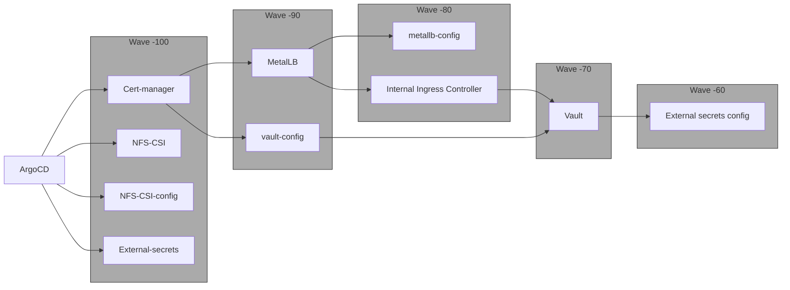

# PodHub: Talos Kubernetes Cluster on Bare-Metal

Terraform project that provisions a **Talos Linux Kubernetes cluster**, installs Cilium as CNI, and deploys ArgoCD. Uses:
- Sidero Labs Talos provider (`talos`)
- Helm provider (`helm`)
- Kubernetes provider (`kubernetes`)
- ArgoCD provider (`argocd`)

---

## Quick Start

1. Edit `terraform.tfvars` with your nodes
2. Run `terraform apply`
3. Export configs:

```bash
terraform output -raw talosconfig > ~/.talos/config
terraform output -raw kubeconfig > ~/.kube/config
```

---

## Architecture (Refactored)

The project is **phase-separated** for clarity and uses **programmatic decision-making** via Terraform locals instead of repetitive resource blocks.

### File Structure

| File | Phase | Responsibility |
|:-----|:------|:---------------|
| `0-terraform.tf` | Base | `terraform {}` block + `required_providers`. |
| `0-variables.tf` | Base | Input variable definitions (`var.nodes`, versions, endpoint). |
| `0-secrets.tf` | Base | (Unused) Commented K8s namespaces/secrets. |
| `1-factory.tf` | **Info Phase** | Image Factory API lookups + schematic definitions. + `local.architecture_to_schematic` map. |
| `2-certs-cilium.tf` | **Info Phase** | TLS CA + certificates for Cilium Hubble. No cluster dependencies. |
| `2-cluster-info.tf` | **Info Phase** | Secrets + machine config data sources + **patch composition logic in locals** (`static_patches_by_role`, `per_node_patches`, etc). |
| `3-cluster-apply.tf` | **Action Phase** | Actually touches nodes: `talos_machine_configuration_apply.all`, bootstrap, kubeconfig, health checks. Also defines `local.kubernetes_client_config` for providers. |
| `3-providers.tf` | **Action Phase** | Provider configs (helm, kubernetes, argocd). Simplified: uses `local.kubernetes_client_config` instead of repeating 4 lines each. |
| `4-cilium.tf` | **Apps Phase** | Helm release for Cilium CNI. Depends on `ephemeral.talos_cluster_health.talos`. |
| `5-argocd.tf` | **Apps Phase** | Helm release for ArgoCD. Depends on `ephemeral.talos_cluster_health.kubernetes`. Also contains `data.kubernetes_secret_v1.argocd_admin`. |
| `9-outputs.tf` | Last | Outputs: talosconfig, kubeconfig, node configs, secrets yaml. |
| `terraform.tfvars` | - | User-provided values (`var.nodes`, versions, endpoint). |

**Info Phase**: Reads/generates but does not apply to nodes.  
**Action Phase**: SSHs into nodes, writes config, causes reboots, bootstraps cluster.  
**Apps Phase**: Helm releases deployed into the running cluster.

**Info Phase**: Reads/generates but does not apply to nodes.  
**Action Phase**: SSHs into nodes, writes config, causes reboots, bootstraps cluster.

---

## Node Configuration (Unified)

All nodes are defined in **one map**: `var.nodes`. Each node uses **declarative attributes** to determine behavior:

```hcl
nodes = {
  "192.168.64.15" = {
    role         = "controlplane"   # "controlplane" or "worker"
    architecture = "x86"            # "x86" or "arm64-rpi"
    disk         = "/dev/vda"
    hostname     = "absolute-overlord-1"
    location = {
      region = "ESP"
      zone   = "Barcelona"
    }
    taints = {}  # optional, only used for workers
  }
}
```

### How Attributes Decide Things (Programmatically)

| Node Attribute | Determines |
|:---------------|:-----------|
| `role` | **Static patches applied**: `controlplane` gets `admissionControl.yaml` + `CNI.yaml` in addition to base patches. Also selects `data.talos_machine_configuration.controlplane` vs `.worker`. |
| `architecture` | **Image Factory schematic**: `x86` uses `i915` + `intel-ucode` extensions. `arm64-rpi` uses Raspberry Pi overlay. |
| `taints` | Conditionally applied **only for workers**. Workers with non-empty `taints` map get the taints patch. Empty taints = no taints patch. Controlplanes ignore this field entirely. |

**All this logic lives in `2-cluster-info.tf` inside `locals {}` blocks**, not repeated across resource blocks.

---

## Patch Composition (How It Works)

In `cluster-info.tf`, locals build patches dynamically:

```hcl
locals {
  # Static patch sets by role
  static_patches_by_role = {
    controlplane = [kubespan.yaml, registry-mirrors.yaml, admissionControl.yaml, CNI.yaml]
    worker       = [kubespan.yaml, registry-mirrors.yaml]
  }

  # Per-node patches: templates (installation, labels, hostname) + conditional taints
  per_node_patches = {
    for ip, node in var.nodes : ip => concat(
      [installation template, labels template, hostname template],
      node.role == "worker" && taints not empty ? [taints template] : []
    )
  }
}
```

In `cluster-apply.tf`, the **single unified apply resource** just references it:

```hcl
resource "talos_machine_configuration_apply" "all" {
  for_each       = var.nodes
  config_patches = local.per_node_patches[each.key]
  # ...
}
```

---

## Extending

### Add a New Node

Just add an entry to `var.nodes` in `terraform.tfvars`. Nothing else.

```hcl
nodes = {
  # ... existing nodes ...
  "192.168.64.17" = {
    role         = "worker"
    architecture = "x86"
    disk         = "/dev/vda"
    hostname     = "abysmal-underling-2"
    location = { region = "ESP", zone = "Barcelona" }
    taints = { "special" = "hardware:NoSchedule" }
  }
}
```

### Add a New Architecture

1. In `1-factory.tf`:
   - Add a `data.talos_image_factory_..._versions` (extensions or overlays)
   - Add a `resource.talos_image_factory_schematic`
2. In `1-factory.tf`, add to the `architecture_to_schematic` lookup map:
   ```hcl
   locals {
     architecture_to_schematic = {
       x86       = talos_image_factory_schematic.x86.id
       arm64-rpi = talos_image_factory_schematic.arm64_rpi.id
       new-arch  = talos_image_factory_schematic.new_arch.id  # ADD THIS
     }
   }
   ```
3. Use `architecture = "new-arch"` in your node definitions.

### Change Which Static Patches Apply per Role

Edit `local.static_patches_by_role` in `2-cluster-info.tf`. One place, not repeated.

---

## Cheat Sheet

### Reset nodes to maintenance mode

```bash
talosctl reset \
    --system-labels-to-wipe STATE \
    --system-labels-to-wipe EPHEMERAL \
    --reboot=true \
    --graceful=false \
    -n $(kubectl get nodes -o jsonpath='{.items[*].status.addresses[?(@.type=="InternalIP")].address}' | tr ' ' ',')
```

### Reset remote nodes

```bash
talosctl reset \
    --system-labels-to-wipe EPHEMERAL \
    --reboot=true \
    --graceful=false \
    -n 192.168.0.100,192.168.100.181
```

### Delete all resources from Terraform's state

```bash
terraform state rm $(terraform state list)
```

### Get secrets

```bash
terraform output -raw talos_secrets_yaml | yq -y > tfsecrets.yaml
```

### Get node configs

```bash
terraform output -json controlplane_configs | jq -r '.[]'
terraform output -json worker_configs | jq -r '.[]'
```

### Cleanup Cilium connectivity tests

```bash
kubectl delete ns cilium-test-ccnp1 cilium-test-ccnp2 cilium-test-1
```

### Debug pods

```yaml
apiVersion: v1
kind: Pod
metadata:
  name: netshoot-esp
spec:
  terminationGracePeriodSeconds: 0
  containers:
    - name: netshoot
      image: nicolaka/netshoot
      command: ["sleep", "infinity"]
---
apiVersion: v1
kind: Pod
metadata:
  name: netshoot-rosario
spec:
  nodeSelector:
    topology.kubernetes.io/region: ARG
    topology.kubernetes.io/zone: Rosario
  tolerations:
    - key: "region"
      operator: "Equal"
      value: "ARG"
      effect: "NoSchedule"
  terminationGracePeriodSeconds: 0
  containers:
    - name: netshoot
      image: nicolaka/netshoot
      command: ["sleep", "infinity"]
```

---

## Argo Sync Waves Planification


```mermaid
flowchart LR
A_ArgoCD[ArgoCD]
    subgraph S100[Wave -100]
        direction TB
        A_CertManager[Cert-manager]
        A_NFS_CSI[NFS-CSI]
        A_NFS_CSI_Config[NFS-CSI-config]
        A_ExternalSecrets[External-secrets]
    end

    subgraph S90[Wave -90]
        direction TB
        B_CertManager_VaultConfig[vault-config]
        B_MetalLB[MetalLB]
    end

    subgraph S80[Wave -80]
        direction TB
        C_MetalLB_Config["metallb-config"]
        C_Ingress["Internal Ingress Controller"]
    end

    subgraph S70[Wave -70]
        direction TB
        D_Vault["Vault"]
    end

    subgraph S60[Wave -60]
        direction TB
        E_External_secrets_config["External secrets config"]
    end

    %% Connect stage groups to show flow between stages
    A_ArgoCD --> A_CertManager
    A_ArgoCD --> A_NFS_CSI
    A_ArgoCD --> A_NFS_CSI_Config
    A_ArgoCD --> A_ExternalSecrets

    A_CertManager --> B_MetalLB
    A_CertManager --> B_CertManager_VaultConfig

    B_MetalLB --> C_MetalLB_Config
    B_MetalLB --> C_Ingress

    C_Ingress --> D_Vault
    B_CertManager_VaultConfig --> D_Vault

    D_Vault --> E_External_secrets_config

    %% Optional styling for clarity
    classDef stage fill:#aaa,stroke:#333,stroke-width:1px;
    class S100,S90,S80,S70,S60 stage;
```

---

## ToDo

- Add the hostnames to the new multi-document Talos configuration
- Dynamically get the link name so it can be used for VIP configuration
