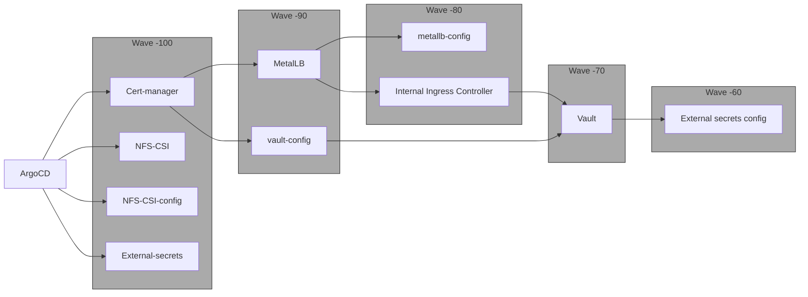

# Instructions

After running `terraform apply`, run the following to export the kubectl and talosctl configuration

```bash
terraform output -raw talosconfig > ~/.talos/config
terraform output -raw kubeconfig > ~/.kube/config
```

# Cheat sheet

## Reset nodes to maintenance mode

```bash
talosctl reset \
    --system-labels-to-wipe STATE \
    --system-labels-to-wipe EPHEMERAL \
    --reboot=true \
    --graceful=false \
    -n $(kubectl get nodes -o jsonpath='{.items[*].status.addresses[?(@.type=="InternalIP")].address}' | tr ' ' ',')
```

## Reset remote nodes

```bash
talosctl reset \
    --system-labels-to-wipe EPHEMERAL \
    --reboot=true \
    --graceful=false \
    -n 192.168.0.100,192.168.100.181
```

## Delete all resources from Terraform's state

```bash
terraform state rm $(terraform state list)
```

## Get data-created configs

```bash
terraform output -json masita_config | jq -r '.[]' > masita_config.yaml
terraform output -json porteño_config | jq -r '.[]' > porteño_config.yaml
```

## Get secrets

```bash
terraform output -raw talos_secrets_yaml | yq -y > tfsecrets.yaml
```

## Cleanup Cilium connectivity tests

```bash
kubectl delete ns cilium-test-ccnp1 cilium-test-ccnp2 cilium-test-1
```

## Debug pods

```yaml
apiVersion: v1
kind: Pod
metadata:
  name: netshoot-esp
spec:
  terminationGracePeriodSeconds: 0
  containers:
    - name: netshoot
      image: nicolaka/netshoot
      command:
        - "sleep"
        - "infinity"
---
apiVersion: v1
kind: Pod
metadata:
  name: netshoot-rosario
spec:
  nodeSelector:
    topology.kubernetes.io/region: ARG
    topology.kubernetes.io/zone: Rosario
  tolerations:
    - key: "region"
      operator: "Equal"
      value: "ARG"
      effect: "NoSchedule"
  terminationGracePeriodSeconds: 0
  containers:
    - name: netshoot
      image: nicolaka/netshoot
      command:
        - "sleep"
        - "infinity"
---
apiVersion: v1
kind: Pod
metadata:
  name: netshoot-caba
spec:
  nodeSelector:
    topology.kubernetes.io/region: ARG
    topology.kubernetes.io/zone: CABA
  tolerations:
    - key: "region"
      operator: "Equal"
      value: "ARG"
      effect: "NoSchedule"
  terminationGracePeriodSeconds: 0
  containers:
    - name: netshoot
      image: nicolaka/netshoot
      command:
        - "sleep"
        - "infinity"
```

# Argo Sync waves planification


```mermaid
flowchart LR
A_ArgoCD[ArgoCD]
    subgraph S100[Wave -100]
        direction TB
        A_CertManager[Cert-manager]
        A_NFS_CSI[NFS-CSI]
        A_NFS_CSI_Config[NFS-CSI-config]
        A_ExternalSecrets[External-secrets]
    end

    subgraph S90[Wave -90]
        direction TB
        B_CertManager_VaultConfig[vault-config]
        B_MetalLB[MetalLB]
    end

    subgraph S80[Wave -80]
        direction TB
        C_MetalLB_Config["metallb-config"]
        C_Ingress["Internal Ingress Controller"]
    end

    subgraph S70[Wave -70]
        direction TB
        D_Vault["Vault"]
    end

    subgraph S60[Wave -60]
        direction TB
        E_External_secrets_config["External secrets config"]
    end

    %% Connect stage groups to show flow between stages
    A_ArgoCD --> A_CertManager
    A_ArgoCD --> A_NFS_CSI
    A_ArgoCD --> A_NFS_CSI_Config
    A_ArgoCD --> A_ExternalSecrets

    A_CertManager --> B_MetalLB
    A_CertManager --> B_CertManager_VaultConfig

    B_MetalLB --> C_MetalLB_Config
    B_MetalLB --> C_Ingress

    C_Ingress --> D_Vault
    B_CertManager_VaultConfig --> D_Vault

    D_Vault --> E_External_secrets_config

    %% Optional styling for clarity
    classDef stage fill:#aaa,stroke:#333,stroke-width:1px;
    class S100,S90,S80,S70,S60 stage;
```

# ToDo

- Add the hostnames to the new multi-document Talos configuration
- Dynamically get the link name so it can be used for VIP configuration
